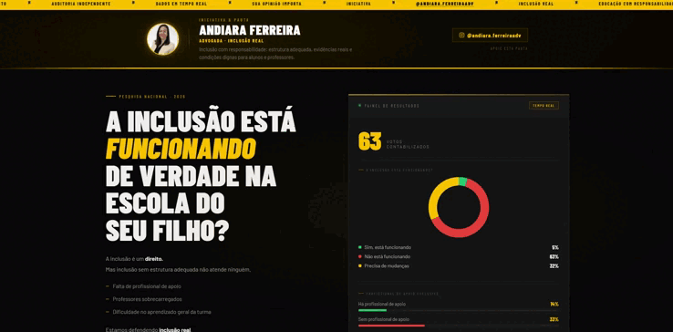
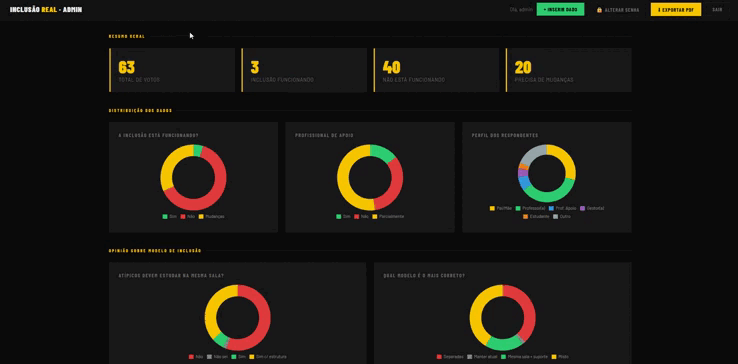

# Inclusão Real 📚

> Uma pesquisa nacional e painel de dados em tempo real sobre a realidade da inclusão escolar no Brasil.

## 💻 Demonstração do Projeto

Abaixo você pode conferir a navegação e o visual completo da plataforma, tanto na visão do usuário quanto na administração do sistema:

### 🌐 Área Pública (Site e Formulário)
Navegação fluida pelo site principal, interface intuitiva e preenchimento da pesquisa de forma responsiva.

<!-- Substitua o link abaixo pelo caminho onde você salvou o GIF do site principal -->

### 🔒 Área Restrita (Painel Administrativo)
Acesso seguro aos dados com **indicadores gráficos interativos**, geração de **relatórios detalhados** e opção de **exportação de dados** para análises aprofundadas.

<!-- Substitua o link abaixo pelo caminho onde você salvou o GIF do painel administrativo -->

## 🎯 Sobre o Projeto

A inclusão é um direito, mas a inclusão sem estrutura adequada não atende ninguém. Este projeto é uma plataforma de pesquisa e auditoria independente que coleta dados de pais, professores e gestores sobre a realidade da inclusão escolar no Brasil.

**Principais funcionalidades:**
- **Coleta de Dados:** Formulário dinâmico e seguro para registro de opiniões.
- **Painel Administrativo (Backend):** Área restrita protegida para gestão das informações.
- **Análise Visual:** Dashboard com gráficos em tempo real processando as respostas recebidas.
- **Relatórios e Exportação:** Ferramentas robustas para extrair, visualizar e exportar o consolidado da pesquisa.
- **Responsividade:** Design adaptado para funcionar perfeitamente em desktops e dispositivos móveis.

## 🛠️ Tecnologias Utilizadas

O projeto foi desenvolvido com uma arquitetura Full Stack, utilizando as seguintes tecnologias:

**Frontend (Interface):**
* HTML5
* CSS3
* JavaScript

**Backend e Banco de Dados (Lógica e Armazenamento):**
* PHP
* MySQL

## 👩‍💻 Autoria

Desenvolvido por [paulo95code].
Iniciativa e pauta por Andiara Ferreira.
